# Fruit classification and detection using deep convolutional models

This study aimed to recognize and detect the images in [Fruit 360](https://www.kaggle.com/moltean/fruits) (The one released on  16.01.2019 was used).
The goals of this research are hence twofolds: 
(1) to develop a fruit image classifier using the single-fruit images; and
(2) to build a fruit image detector using the multi-fruit images. 
To carry out the classification task, 10 CNN-based classification models were proposed. Moreover, this study introduced *SHapley Additive exPlanations* 
to explain the model predictions. To build the detector, a CNN-based detection algorithm *you only look once* was employed in light of its accuracy and speed in previous work. 
Results of this study showed that the best-performing classification model achieved 99.64% accuracy and 99.63% F1 score on the test dataset.

# Classification Models

## Model Settings

10  CNN-based models with different configurations were proposed. These models shared a base architecture, which is shown below. The base  model consisted of an input layer, four convolutional-pooling-alternating blocks, two dense layers and an output layer with softmax function.

| Layer Type                                                    | Dimensions             |
|---------------------------------------------------------------|------------------------|
| Input                                                         | 64 x 64 x 3            |
| (HSV transformation)                                          | -                      |
| Convolutional                                                 | 3 × 3 × 32 (Stride: 1) |
| ReLU or LReLU (alpha = 0.1, 0.3 or 0.5) (Batch Normalization) | -                      |
| Max Pooling                                                   | 2 × 2 (Stride: 2)      |
| (Dropout (rate: 0.2))                                         | -                      |
| Convolutional                                                 | 3 × 3 × 64 (Stride: 1) |
| ReLU or LReLU (alpha = 0.1, 0.3 or 0.5) (Batch Normalization) | -                      |
| Max Pooling                                                   | 2 × 2 (Stride: 2)      |
| (Dropout (rate: 0.2))                                         | -                      |
| Convolutional                                                 | 3 × 3 × 32 (Stride: 1) |
| ReLU or LReLU (alpha = 0.1, 0.3 or 0.5) (Batch Normalization) | -                      |
| Max Pooling                                                   | 2 × 2 (Stride: 2)      |
| (Dropout (rate: 0.2))                                         | -                      |
| Convolutional                                                 | 3 × 3 × 64 (Stride: 1) |
| ReLU or LReLU (alpha = 0.1, 0.3 or 0.5) (Batch Normalization) | -                      |
| Max Pooling                                                   | 2 × 2 (Stride: 2)      |
| (Dropout (rate: 0.2))                                         | -                      |
| Dense                                                         | 256 × 1                |
| Dropout (rate: 0.2)                                           | -                      |
| Dense                                                         | 512 × 1                |
| Dropout (rate: 0.2)                                           | -                      |
| Softmax                                                       | 95 × 1                 |

The table below shows the difference of the proposed models. Broadly speaking, the settings differed in which regularization techniques and which activation functions were used. HSV transformation was also applied in the the second and the fifth model. Furthermore, models (model 1 and model 3) with different orders of batch normalization and ReLU were compared. A learning rate scheduler was used to change the learning rate as the training progressed.

|          | Configuration                                       |
|----------|-----------------------------------------------------|
| Model 1  | Batch normalization + ReLU                          |
| Model 2  | HSV transformation + Batch normalization + ReLU     |
| Model 3  | ReLU + Batch normalization                          |
| Model 4  | ReLU + Dropout                                      |
| Model 5  | HSV transformation + ReLU + Batch normalization     |
| Model 6  | Batch normalization + ReLU + learning rate schedule |
| Model 7  | Batch normalization + LReLU (0.1)                   |
| Model 8  | Batch normalization + LReLU (0.3)                   |
| Model 9  | LRelu (0.3) + Batch normalization                   |
| Model 10 | LRelu (0.5) + learning rate scheduler               |

The following table lists values of the hyper-parameters, which were given before training and not trainable. The hyper-parameters remained the same in all the proposed models, except for the number epochs. If the learning rate scheduler was used, the number of epochs was 15.

| Hyperparameter | Value    |
|----------------|----------|
| Batch size     | 512      |
| Epochs         | 10 or 15 |
| Learning rate  | 0.02     |

## Model Results

The training dataset was firstly split into two parts, 95% and 5%, and the smaller part was used as the validation set. The following plots show the training and validation performance of the 10 models. The training and validation accuracy in most models plateaued after the 4th epoch and even started to drop after the 6th epoch.

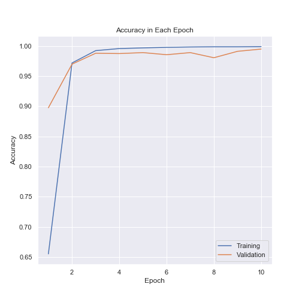
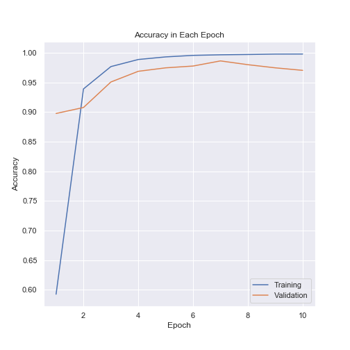
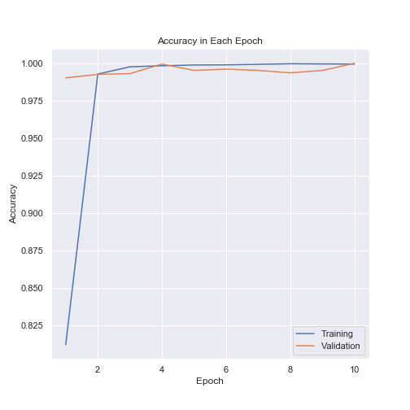
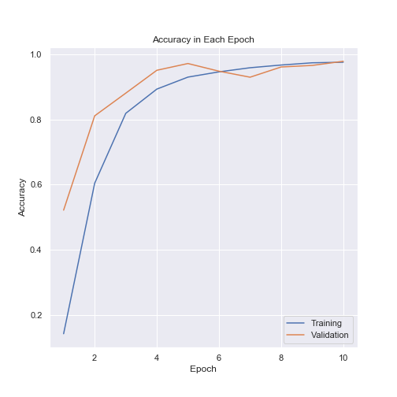
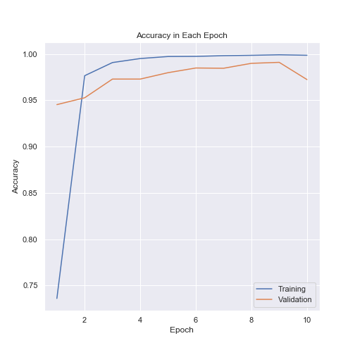
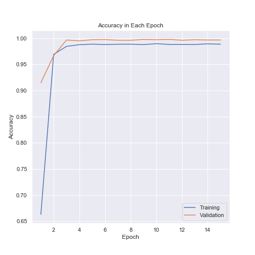
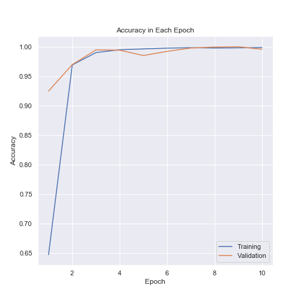
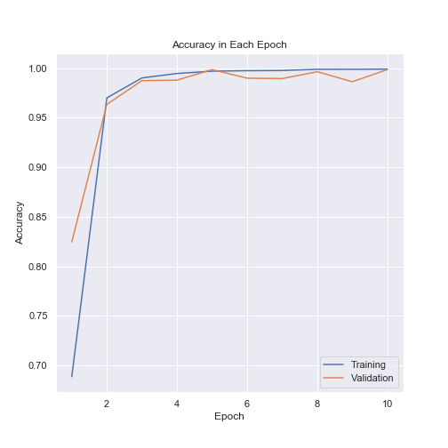
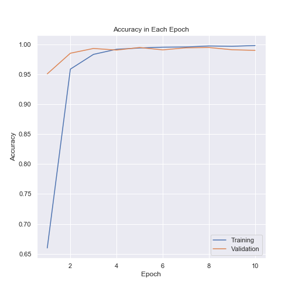
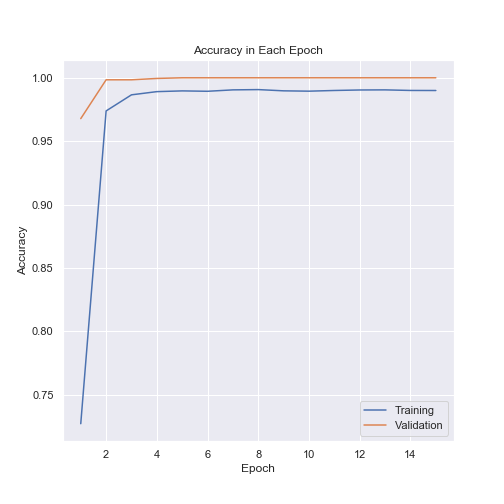

The following table shows  the  accuracy  of  the  10  models  on  the  test  dataset.   Model 1 (batch normalization + ReLU) outperformed other models in four measures, reaching 99.64% accuracy, 99.65% precision, 99.64% recall and 99.63% F1 score.

| Model    | Accuracy | Precision | Recall | F1 score |
|----------|----------|-----------|--------|-----------|
| model 1  | 99.64%   | 99.65%    | 99.64% | 99.63%    |
| model 2  | 97.64%   | 97.76%    | 97.49% | 97.44%    |
| model 3  | 99.38%   | 99.39%    | 99.35% | 99.34%    |
| model 4  | 97.11%   | 97.30%    | 97.16% | 97.02%    |
| model 5  | 97.06%   | 97.22%    | 97.69% | 97.82%    |
| model 6  | 98.78%   | 98.87%    | 98.74% | 98.72%    |
| model 7  | 99.57%   | 99.57%    | 99.56% | 99.55%    |
| model 8  | 99.03%   | 99.14%    | 99.18% | 99.04%    |
| model 9  | 99.22%   | 99.28%    | 99.23% | 99.20%    |
| model 10 | 98.40%   | 99.50%    | 99.44% | 99.39%    |

## Investigation of the Results

The following figure compares the accuracy in each class of the 10 models. In the best-performing  model, namely, model 1, the class with the lowest accuracy was apple red yellow 1, and the accuracy was 83.53%, while model 9 and model 10 had 100% accuracy in this class.

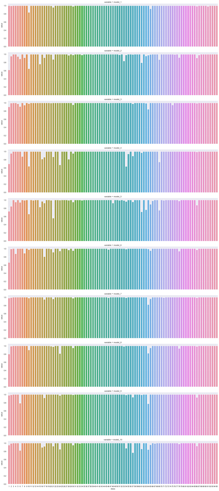

SHAP was employed in thus study to account for how the model made the predictions. As noted previously, images of apple red yellow 1 were mostly misclassified into apple  golden 1. The reason for the errors could be attributed to the yellow area. The figure below displays that the yellow area contributed positive probabilities to the class apple golden 1, while the red part in the image of fruit decreased the probability.  Furthermore, the larger the yellow area was, the more red regions the image had.

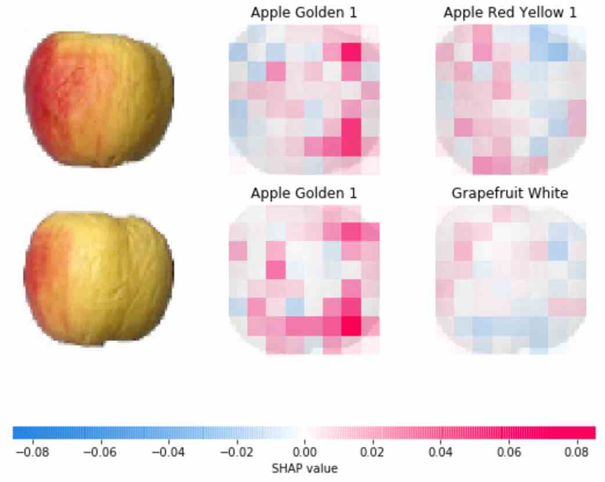

# Custom Darknet

The multi-fruit images were firstly augmented by flipping, rotating and cropping and annotated using [labelImg](https://github.com/tzutalin/labelImg). The annotated images can be downloaded [here](http://tiny.cc/pr0xaz). 

The custom Darknet followed the settings from [AlexeyAB/darknet](https://github.com/AlexeyAB/darknet), and the results are displayed below.

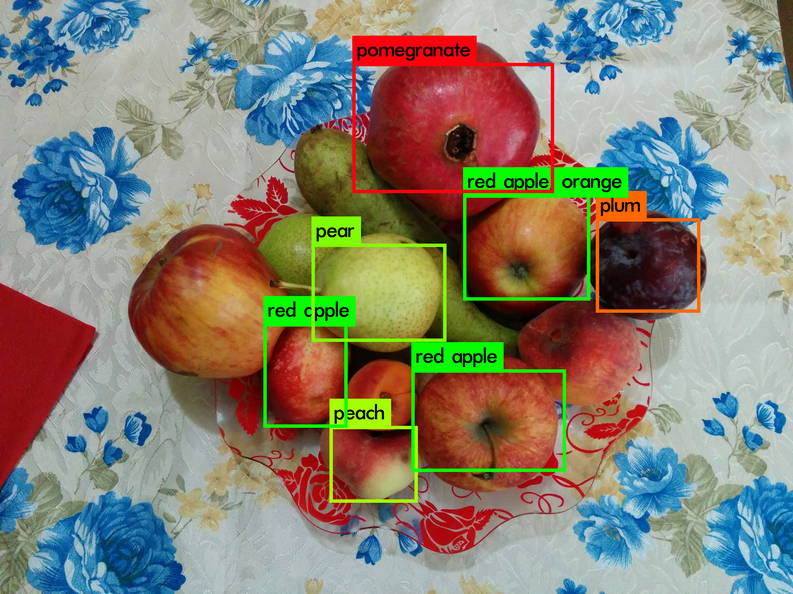
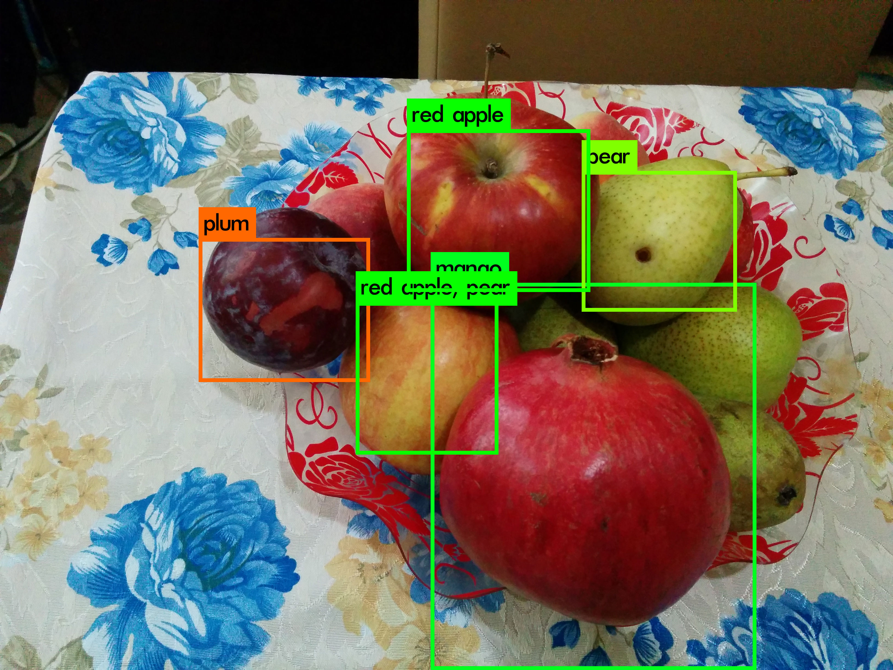
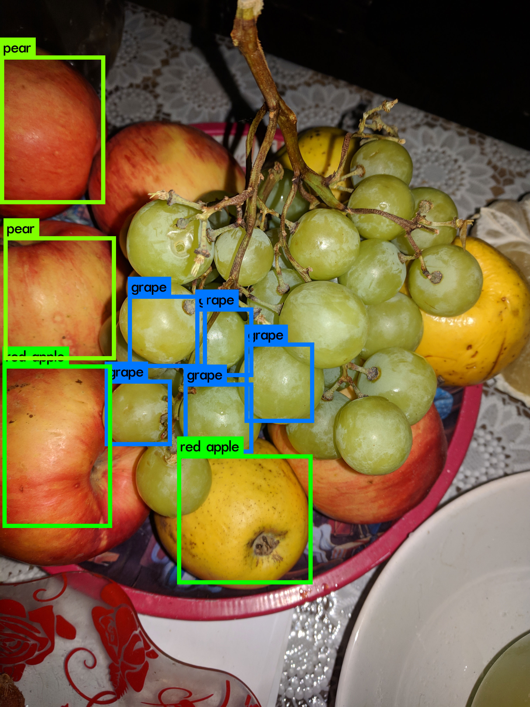
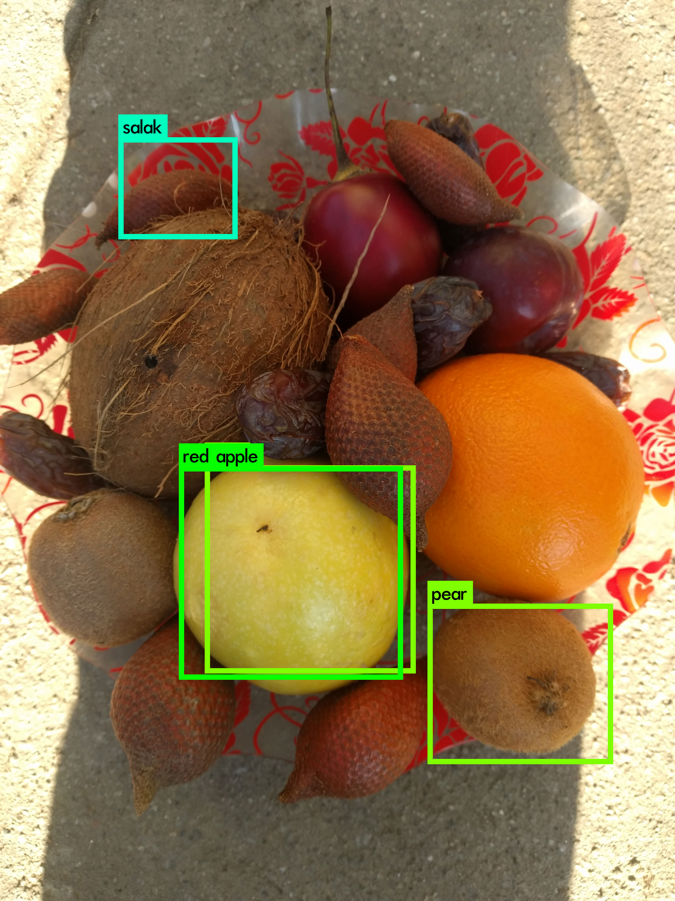

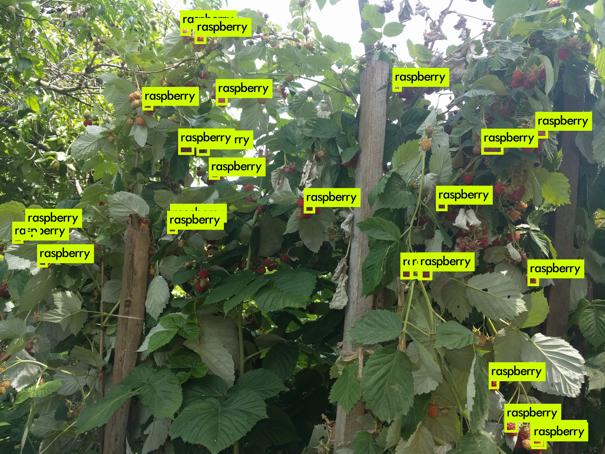
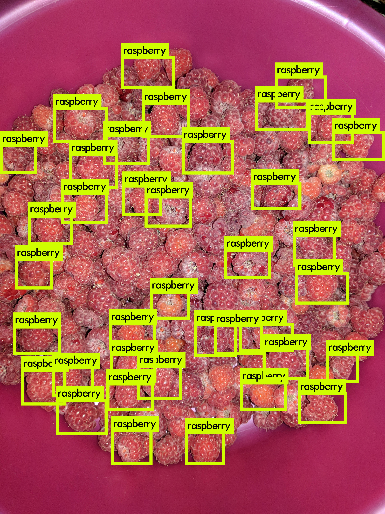
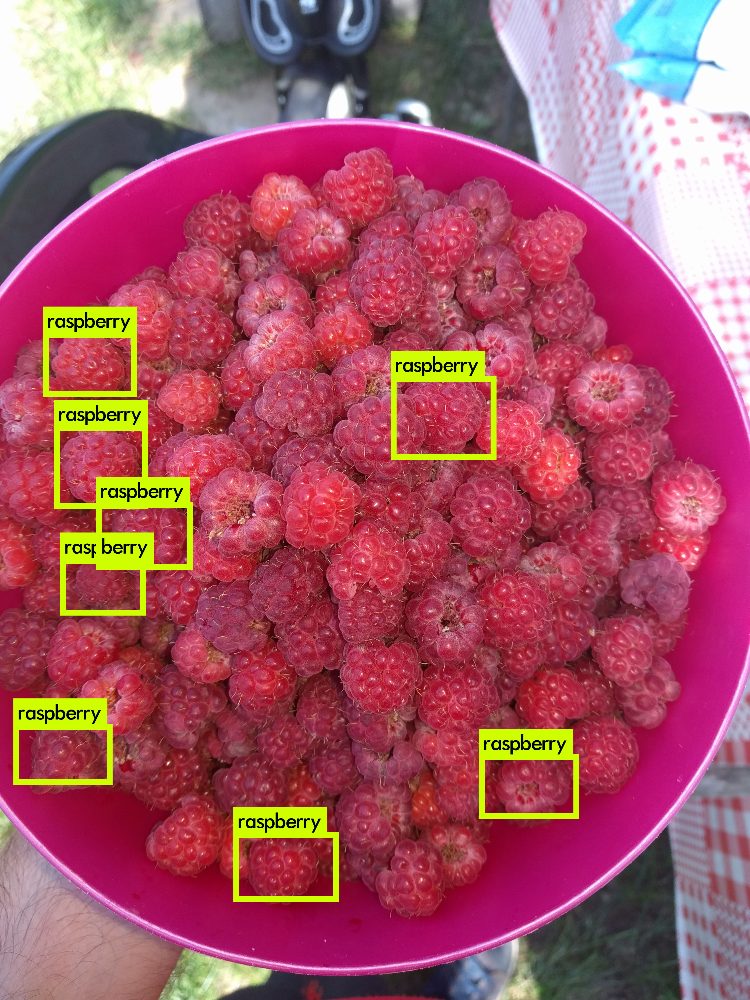
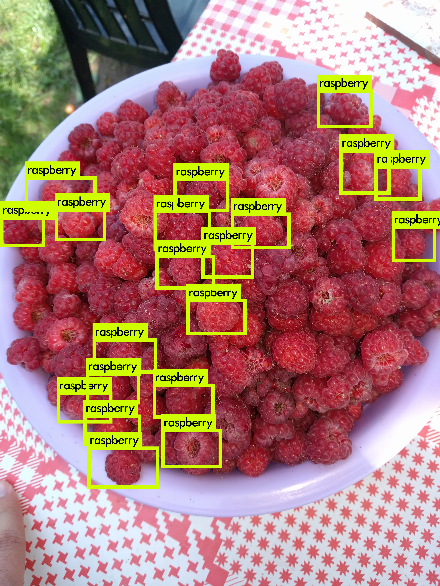